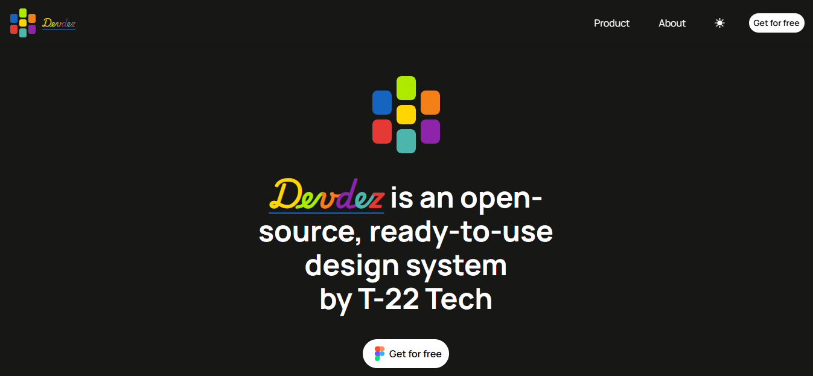
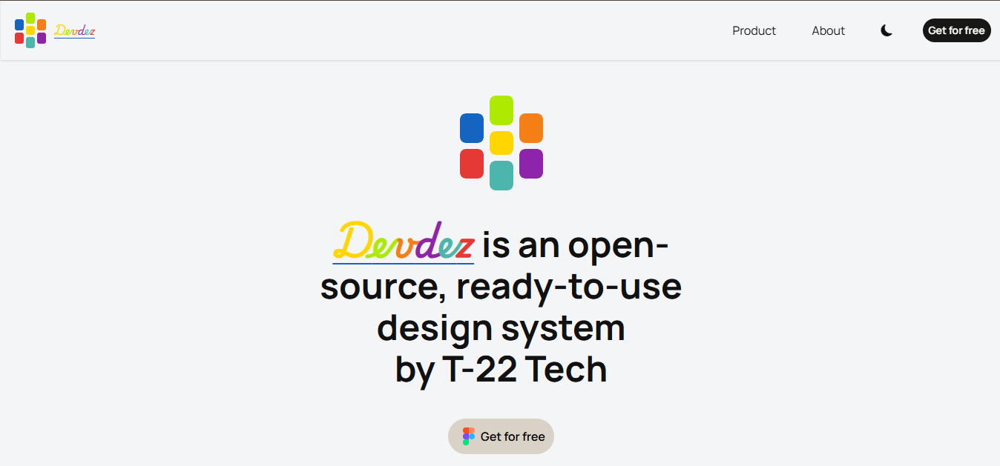
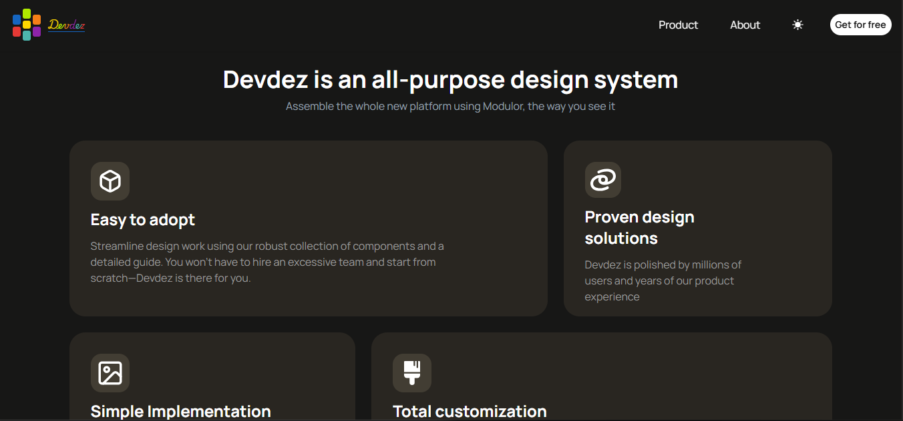
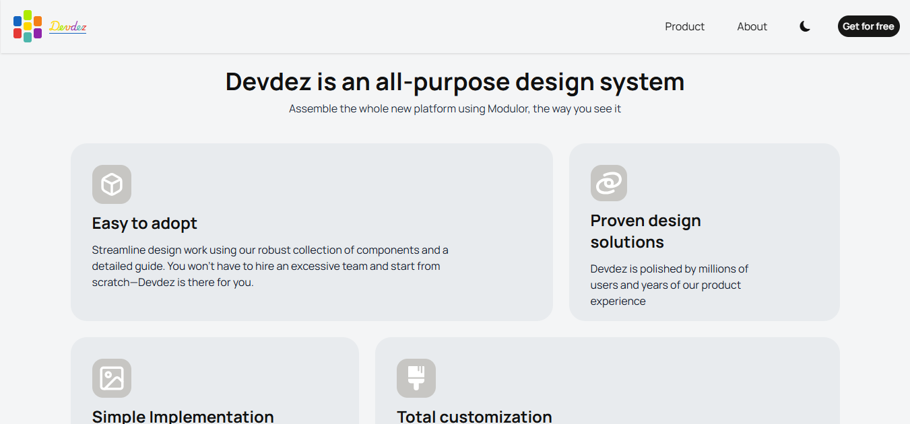
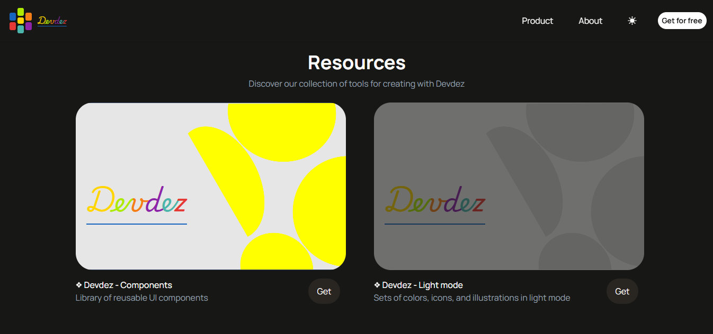
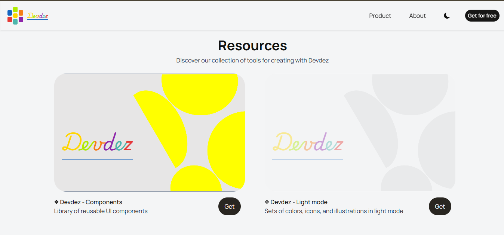
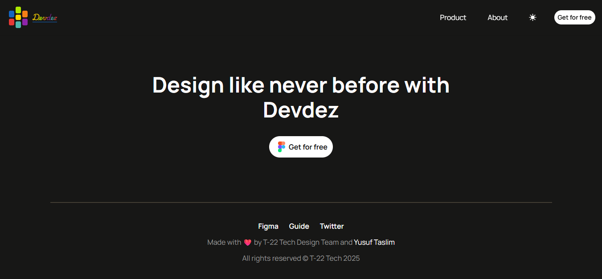
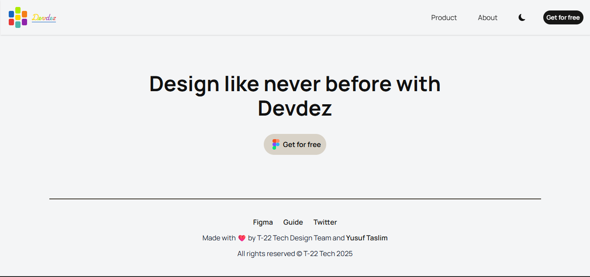

# Devdez – Modern Frontend Design System Landing Page



A sleek, responsive landing page for **Devdez**, an open-source, ready-to-use frontend design system created by T-22 Tech. This conceptual marketing site showcases the system's modular approach, ease of adoption, and full customization potential while supporting both **light and dark themes**.

**Live Demo:** [Insert live demo link if deployed, e.g., Vercel/Netlify]  
**Note:** This is a static promotional page for a fictional/open-source design system – the actual component library is conceptual.

## Overview

Devdez promotes rapid, consistent UI development with reusable components, proven patterns, and total flexibility. Key sections include:

- **Hero Sections** (light & dark): Bold messaging – "Design like never before with Devdez" and "Devdez is an open-source, ready-to-use design system by T-22 Tech".
- **Feature Cards**: Easy to adopt, Proven design solutions, Simple implementation, Total customization.
- **Resources Section**: Downloadable assets like "Devdez - Components" (reusable UI library) and "Devdez - Light mode" (colors, icons, illustrations).
- **Theme Toggle**: Seamless light/dark mode switching (sun/moon icon).
- **Navigation & CTA**: Clean header with Product/About links and prominent "Get for free" buttons.

The design prioritizes modern aesthetics, accessibility, and mobile-first responsiveness.

## Features

- Fully responsive layout (mobile, tablet, desktop)
- Light and dark theme support with smooth toggle
- Clean, minimalist typography and spacing
- Strong visual hierarchy with icons and card-based content
- Consistent branding with colorful logo and gradient accents

## Tech Stack

- HTML5 / CSS3 (utility-first styling using Tailwind CSS and custom classes)
- TypeScript and Angular for interactivity and logic
- Hosted on Netlify 

## Screenshots










## Setup (If Cloning)

```bash
git clone https://github.com/TaslimYusuf2210/devdez.git
cd devdez-landing
# Simply open index.html in your browser
# Or deploy instantly to Vercel/Netlify